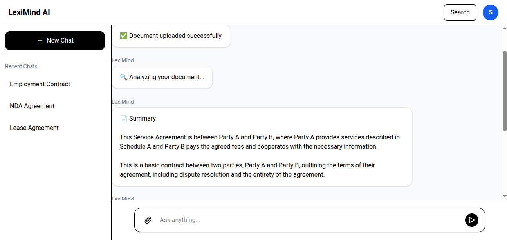

# 📄 LexiMind AI

LexiMind AI is a full-stack AI-powered document intelligence platform that enables users to upload PDF documents, generate AI summaries, extract important clauses, identify risks and obligations, and interact with documents using Retrieval-Augmented Generation (RAG).

Built with FastAPI, React, PostgreSQL + pgvector, and Groq LLM.

---

## ✨ Features

- 🔐 JWT Authentication
- 📄 PDF Upload & Storage
- 📑 Automatic Text Extraction
- ✂️ Semantic Text Chunking
- 🧠 Vector Embedding Generation
- 🔍 Semantic Search using pgvector
- 🤖 AI-powered Document Analysis
- 💬 Conversational Document Chat
- ⚡ FastAPI REST API
- 🎨 Responsive React Frontend
- 🗄 PostgreSQL Database

---

# Demo


| Dashboard | Chat |
|-----------|---



---

# Tech Stack

## Frontend

- React
- Vite
- Tailwind CSS
- Axios

## Backend

- FastAPI
- SQLAlchemy
- PostgreSQL
- pgvector
- JWT Authentication
- PyMuPDF

## AI Stack

- Groq API
- RAG (Retrieval-Augmented Generation)
- Sentence Transformers
- Vector Similarity Search

---

# Architecture

```
                React Frontend
                       │
                       ▼
                 FastAPI Backend
                       │
      ┌────────────────┼────────────────┐
      │                │                │
      ▼                ▼                ▼
 Authentication   Document API      Chat API
      │                │                │
      └────────────────┼────────────────┘
                       ▼
                PDF Processing
                       │
             Text Extraction (PyMuPDF)
                       │
                Document Chunking
                       │
              Embedding Generation
                       │
            PostgreSQL + pgvector
                       │
             Semantic Retrieval
                       │
                    Groq LLM
                       │
          Summary • Risks • Chat
```

---

# Project Structure

```
LexiMind-AI/

├── backend/
│   ├── app/
│   │   ├── api/
│   │   ├── services/
│   │   ├── models/
│   │   ├── schemas/
│   │   ├── database/
│   │   └── main.py
│   │
│   ├── uploads/
│   ├── pyproject.toml
│   └── uv.lock
│
├── frontend/
│   ├── src/
│   ├── public/
│   └── package.json
│
└── README.md
```

---

# Workflow

## 1. Upload PDF

User uploads a PDF document.

↓

## 2. Extract Text

The backend extracts text using PyMuPDF.

↓

## 3. Chunk Document

Large documents are divided into smaller semantic chunks.

↓

## 4. Generate Embeddings

Each chunk is converted into vector embeddings.

↓

## 5. Store in PostgreSQL

Embeddings are stored in pgvector for similarity search.

↓

## 6. AI Analysis

Groq LLM generates:

- Summary
- Important Clauses
- Risks
- Obligations
- Missing Information

↓

## 7. Document Chat

User asks questions.

Relevant chunks are retrieved from pgvector and sent to Groq for context-aware responses.

---

# API Endpoints

## Authentication

| Method | Endpoint |
|---------|----------|
| POST | `/auth/register` |
| POST | `/auth/login` |

---

## Documents

| Method | Endpoint |
|---------|----------|
| POST | `/documents/upload` |
| GET | `/documents` |
| GET | `/documents/{id}` |
| POST | `/documents/{id}/analyze` |
| GET | `/documents/{id}/analysis` |
| POST | `/documents/{id}/chat` |

---

# Installation

## Clone Repository

```bash
git clone https://github.com/7430souvik/LexiMind-AI.git
```

```bash
cd LexiMind-AI
```

---

## Backend

```bash
cd backend
```

Install dependencies

```bash
uv sync
```

Run

```bash
uv run uvicorn app.main:app --reload
```

---

## Frontend

```bash
cd frontend
```

```bash
npm install
```

```bash
npm run dev
```

---

# Environment Variables

Backend `.env`

```env
DATABASE_URL=
JWT_SECRET_KEY=
GROQ_API_KEY=
ALGORITHM=HS256
ACCESS_TOKEN_EXPIRE_MINUTES=30
```

---

# Future Improvements

- OCR support for scanned PDFs
- Multi-document chat
- Document comparison
- AI contract review
- Citation-aware responses
- Streaming responses
- Background processing with Celery
- Cloud storage (AWS S3)

---

# Challenges Solved

- Implemented Retrieval-Augmented Generation (RAG)
- Managed long-document processing with chunking
- Built semantic search using pgvector
- Integrated Groq LLM for document intelligence
- Designed an asynchronous document analysis workflow
- Implemented secure JWT authentication
- Structured scalable FastAPI services

---

# Deployment

Frontend

- React
- Vercel

Backend

- FastAPI
- Render

Database

- PostgreSQL
- pgvector

---

# Author

**Souvik Chatterjee**

AI Engineer | Full Stack Developer

GitHub:
https://github.com/7430souvik

LinkedIn:
(Add your LinkedIn URL)

---

## ⭐ If you found this project useful, please consider giving it a star.
